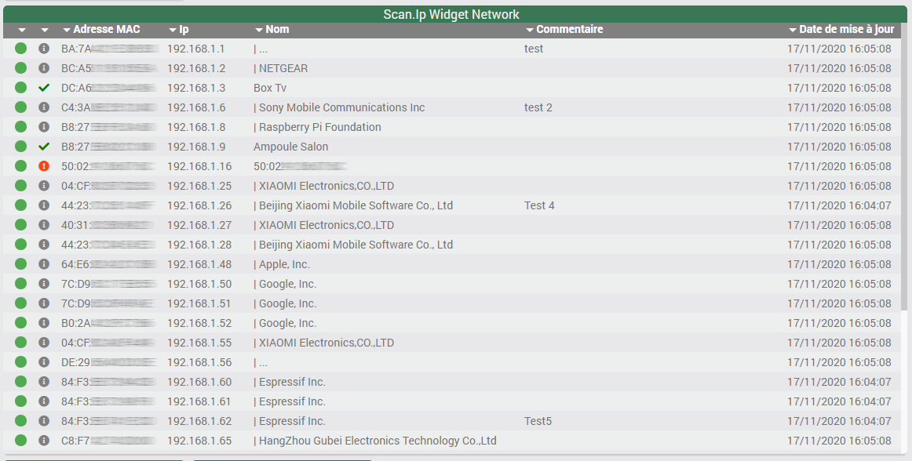
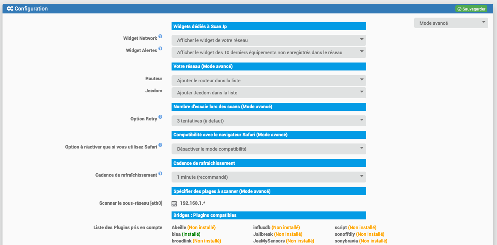
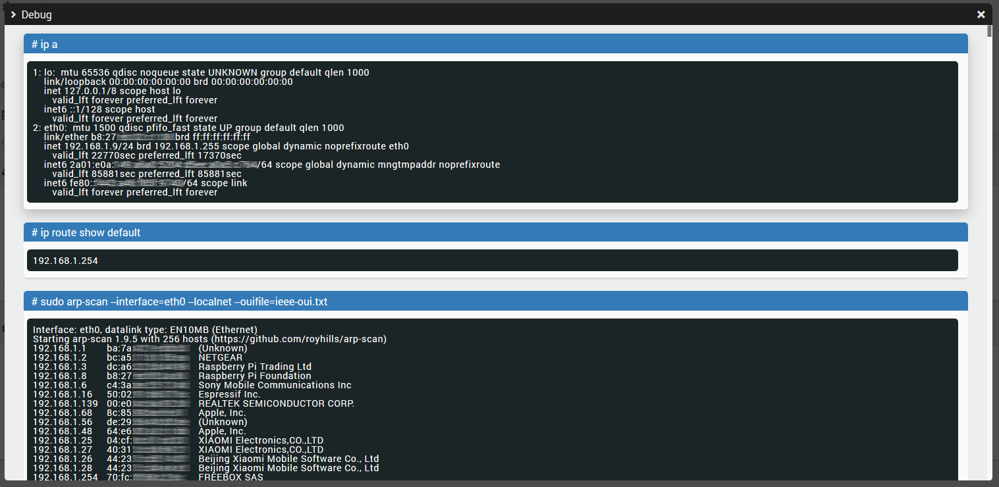
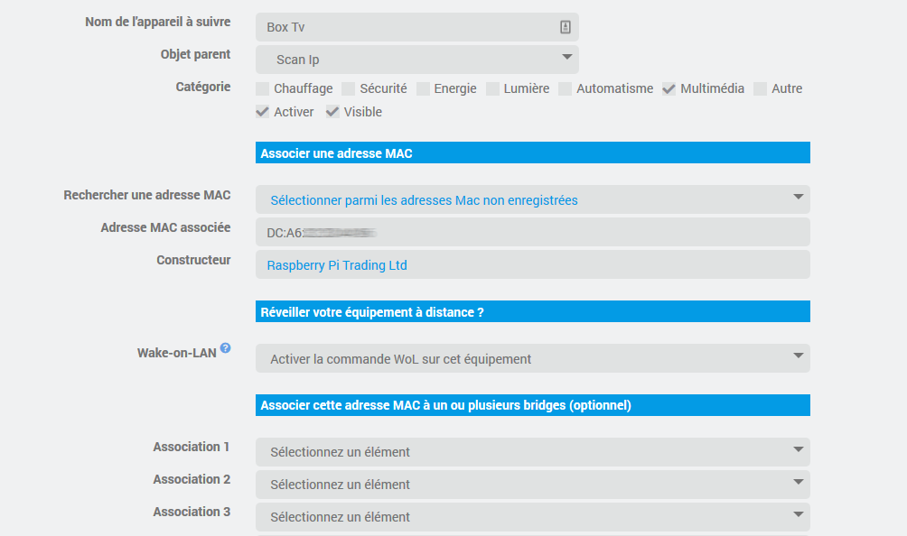
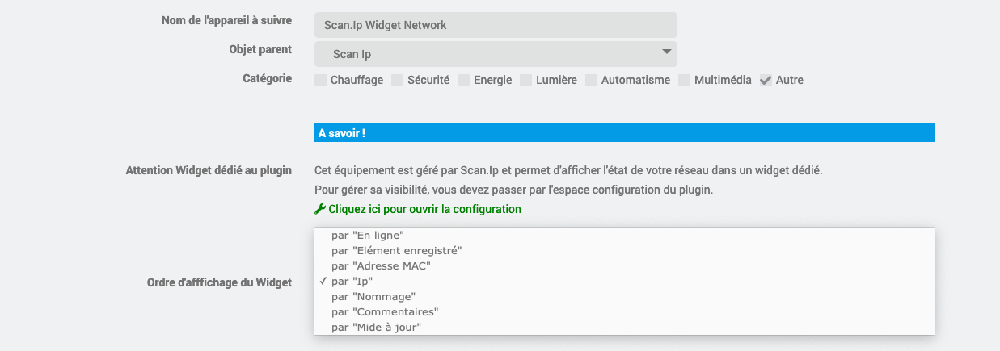

Description
===

Ce plugin sert à scanner votre réseau et à récupérer la liste des équipements qui y sont connectés ainsi que leurs adresses MAC.

Avec ces informations, le plugin permet :
- récupérer la nouvelle Ip d'un équipement
- d'afficher un widget qui référence l'état de votre réseau
- d'afficher un widget qui permet de référencer les équipements, non enregistrés, qui viennent de se connecter sur le réseau
- d'afficher un widget par équipement enregistré et mise à disposition des commandes associés à cet équipement
- se faire des alertes quand un appareil disparait, apparait ou change d’ip, sur le réseau
- d'automatiser des changements d'ip en cascade sur d'autres plugins par le biais de bridges
- de donner la possibilité d'allumer un équipement à distance (Wake-on-LAN)

Installation et dépendances
===

- Ce plugin nécessite impérativement "arp-scan", "wakeonlan", "etherwake".
- L'utilisation des fichiers "oui.txt" et "iab.txt" proposés par "standards-oui.ieee.org"
- Les API proposées par "macvendors.com" et "macvendors.co"

# Configuration

Afin de faciliter l'utilisation de ce plugin, celui-ci permet d'adapter les options proposées en trois modes "normal", "avancé" et "debug".

## Mode normal

Le mode normal affiche les paramètres principaux et qui généralement s'adapte aux configurations standards.

### Widget Network

Cette option permet d'afficher ou non le widget d'affichage du réseau.

> Vous avez la possibilité de trier les colonnes par un simple clic

> Vous avez aussi la possibilité de configurer un trie à defaut en allant dans l'équipement en lien avec ce widget.

### Widget Alertes

Cette option permet d'afficher ou non le widget d'affichage des alertes.

> Ce widget n'affiche que les équipements non enregistrés et l'ordre d'affichage est trié par ((dateConnexion).(datePremierReferencement)). Ainsi, un équipement tout nouveau apparaitra en première position.

### Cadence de rafraichissement

Sert à régler la cadence de rafraichissement de la tâche planifiée. 
A defaut, celle-ci est réglée à 1 minute.

> A savoir, à chaque scan du réseau tous les périphériques ne répondent pas forcément car ils mettent trop de temps à répondre (ex. périphériques Wifi). Il est donc conseillé d'au moins réaliser 3 scans avant de déterminer qu'un périphérique est vraiment Hors ligne. Vous verrez que vous avez la possibilité de régler plus finement ce paramètre au niveau des équipements.

### Liste des Plugins pris en compte

Scan.ip utilise des bridges pour mettre à jour des données sur certains plugins. Un indicateur vous permettra de voir si le plugin est présents dans votre Jeedom ou non.

> Dans les faits cela permet d'automatiser, par le biais de bridges, le changement d’ip d’un device dans les autres plugins quand celui-ci a décidé de changer d’ip (par exemple quand on est dans l'impossibilité de fixer une Ip dans le DHCP) 

Vous pourrez ainsi associer un équipement à un ou plusieurs plugins.

## Mode avancé

### Routeur

Permet d'ajouter le routeur dans la liste du réseau. A defaut celui-ci est retiré.

### Jeedom

Permet d'ajouter le serveur Jeedom dans la liste du réseau. A defaut celui-ci est retiré.

### Option Retry

Cela permet de régler le nombre de tentatives lors des scans du réseaux. En effet, tous les équippements ne répondent pas en dès la première tentative de scan. A noter que plus vous avez de tentatives, plus le scan mettre du temps à répondre.

### Compatibilité avec le navigateur Safari

Sur le navigateur web Safari le mode caché dans le menu de sélection, qui permet de n'afficher que les bridges non utlisés, n'est pas compatible. De ce fait, en activant cette option, les menus déjà utilisés seront désactivés. Cette option n'est à activer que si vous rencontrez le problème sur Safari.

### Spécifier des plages réseau à scanner

Lorsque vous avez plusieurs cartes réseaux ou plus particulièrement des sous-réseaux il convient de spécifier le ou les sous réseaux à scanner.

> Pour information, un sous-réseau peut ne pas permettre de récupérer les adresses MAC de celui-ci (blocage au niveau du routeur ou autres). Si vous rencontrez ce problème, il vous faudra installer un autre jeedom dans celui-ci avec un Scan.ip dédié pour gérer ce même sous-réseau.

## Mode debug

## Fichiers présents

Sert à vérifier la présence du fichier oui.txt et iab.txt ainsi que leurs dates de mise à jour.

> Ces deux fichiers servent à faire le lien entre une adresse MAC et un constructeur

## Dépendances

Permet de visualiser, facilement, les dépendances qui sont en echec.

# Gestion des équipements

> Le équipements sont séparés en deux parties : "Les équipements MAC" et les "Widgets dédiés et gérés par Scan.Ip". Il convient de ne pas supprimer ses derniers sauf en cas de bug. Poru les supprimer, il vous faudra activer le mode debug pour que le bouton "supprimer" apparaisse. 

## Icones d'accès

> Lors d'un changement de mode, il vous faudra raffraichir la page pour voir les modifications apparaitre.

En mode debug vous verrez apparaitre une icone debug

### Ajouter un équipement MAC

Ceci permet d'ajouter un équipement quand vous connaissez l'adresse MAC du périphérique que vous voulez ajouter.

> A noter qu'il est plus simple de passer par "Enregistrements non enregistrés" qui vous permettra d'ajouter, à la volée, un ou plusieurs équipements présents dans votre réseau.

### Synchroniser

Force le lancement d'un nouveau scan et la mise à joru des équipements

> Si un scan est déjà en cours l'action ne sera pas possible.

### Réseau

Le tableau affiche l'ensemble du réseau :

- La 1er colonne indique si le périphérique est "En ligne" ou "Hors ligne"
- La 2em colonne indique si l'équipement est "enregistré", "enregistré mais désactivé" ou "non enregistré"
- La 3em colonne indique l'adresse MAC de l'équipement
- La 4em colonne indique l'ip de l'équipement
- La 5em colonne indique le nom de l'équipement si il est enregistré ou bien le nom du constructeur, précédé d'un "|".
- La 6em colonne permet d'associer des commentaires à un équipement (il vous faudra sauvegarder les commentaires pour qu'ils soient pris en compte)
- La 7em colonne indique la dernière date de parution de l'équipement

> Si vous constatez des "|..." dans le nom des équipements c'est que celui-ci n'a pas été reconnu

### Equipements enregistrés

- La 1er colonne indique si le périphérique est "En ligne" ou "Hors ligne"
- La 2em colonne indique le nom de l'équipement
- La 3em colonne indique l'adresse MAC de l'équipement
- La 4em colonne indique l'ip de l'équipement
- La 5em colonne indique l'ip utilisée lors de la dernière connexion
- La 6em indique la dernière date de parution de l'équipement
- La 7em colonne indique tous les bridges associées à l'équipement. En cliquant sur ceux-ci vous serez dirigé vers l'équipement du plugin associé.

### Equipements non-enregistrés

- La 1er colonne permet de sélectionner l'équipement* (pour l'ajouter "à la volée" parmis vos équipements ou à le supprimer des archives du réseau)
- La 2em colonne indique le nom de l'équipement
- La 3em colonne affcihe le commentaires associé à l'équipement
- La 4em colonne indique l'adresse MAC de l'équipement
- La 5em colonne indique l'ip utilisée par l'équipement
- La 6em indique la date du premier enregistrement dans votre réseau
- La 7em colonne la dernière date de parution de l'équipement

> * Lorsque vous sélectionnez un ou plusieurs éléments des boutons d'actions apparaissent

### Debug (uniquemenent mode Debug)

Cette modale a pour but d'aider à comprendre les éventuels bugs qui pourraient apparaitre.

#### # ip a

Résultat de la commande "ip a" et qui affiche la liste de tous les réseaux accessibles depuis votre Jeedom.

#### # ip route show default

Affiche l'ip du routeur associé à votre Jeedom.

#### # sudo arp-scan -r 3 --interface=eth0 --localnet --ouifile=ieee-oui.txt

> Ici c'est le réseau "eth0" qui est sélectionné mais cela est spacifique à votre réseau

Résultat de la commande "sudo arp-scan -r 3 --interface=eth0 --localnet --ouifile=ieee-oui.txt" et qui affiche la liste des équipements répondant au scan.

> Comme c'était précisé au dessus, il se peut que tous vos appareils connectés ne s'affcihent pas en un scan. C'est piur cela qu'il est important de faire plusieurs scan pur avoir un retour plus juste de qui est connecté.

#### # Equipements

Affiche les données présentent dans le json équipement. C'est l'historique de tous les équipemnents qui se sont connectés à votre réseau.

#### # Mappings

Affiche les données présentent dans le json mapping. C'est me dernier état de votre réseau avec la version de "arp-scan" utilisé.

### Configuration

Ce point a déjà été traité au début.

## Vos équipements 

### En mode normal

#### Rechercher une adresse MAC

Ce menu de sélection vous permet d'aller directement rechercher un éléments dans votre réseau et de récupérer son adresse MAC.

> Seules les adresses MAC non associées sont présentes pour éviter les doublons.

#### Adresse MAC associée

Ce champ est :
- soit rempli automatiquement avec le menu de sélection "Rechercher une adresse MAC"
- soit vous pouvez le remplir manuellement si vous vouler anticiper des entrées d'équipement dans votre réseau

#### Constructeur

Si le constructeur a été identifié il sera inscrit ici.

#### Wake-on-LAN

Ceci permet d'ajouter une commande d'action WoL qui permettra d'allumer un équipement à distance.

> Vérifiez que votre équipement soit compatible et/ou que l'option ait bien été activée pour que cela fonctionne.

#### Association

Comme vu dans la partie configuration, c'est ici que l'on associe les plugins à Scan.Ip avec les bridges.

> Dans le menu de sélection l'information est indiquée ainsi [nom du plugin][ip enregistrée au niveau du plugin :: Sous nom de config (si présent)] Nom de l'équipement du plugin cible.

> Attention cette option fait des modifications sur les autres plugins. A utiliser en connaissance de cause. L'auteur du plugin cible n'est nullement responsable des disfonctionnements que cela pourrait créer sur son plugin.

> Cela va de soit ! Tant que vous ne faites pas d'association à un plugin, Scan.ip ne fera aucune modification sur celui-ci.

> Si vous êtes un développeur et que vous souhaitez proposer un bridge complémentaire c'est tout à fait possible. Soit en proposant directement un ajout sur le GitHub (https://ynats.github.io/jeedom-plugin-scan.ip/) soit en passant par le forum.

### En mode avancé

#### Rappel "Configuration"

Cela vous permet de bien avoir en tête la configuration que vous aviez enregistré.

#### Présumé hors-ligne au bout de

A defaut à 4 minutes, ce qui veut dire que si vous avez tout laissé à defaut cela fait 1 scan toutes les minutes et 4 passages pour déterminer si l'équipement est bien hors ligne.
Souvenez-vous, tous les équipements ne resortent pas forcément aux différents scans.

> Si vous avez réglé la cadence de rafraichissement à 3 minutes cela veut dire qu'il faut au moins régler ce paramètre à 15 minutes.

> Ce paramètre peut être modifié sur des équipements en LAN et très réactifs. Il conviendrait de baisser à 2 minutes par exemple pour une cadence à 1 minute. Cela reviendrait à 2 passages pour déterminer le l'état.

### Commandes associées

- IpV4 (ip au format v4 de l'équipement)
- Wol (la commande d'action pour allumer les équipement à distance)
- Last Date (Date au format JJ/MM/AAAA HH:MM:SS de la dernière aparition sur le réseau)
- Last IpV4 (Dernier ip utilisée par l'équipement)
- Last Time (Date au format timestamp de la dernière aparition sur le réseau)
- Online (Etat de l'équipement)

### Widgets associés

# Widgets dédiés et gérés par Scan.Ip

A defaut, cette partie comprend 2 widgets (ils peuvent être renommés) :
- Scan.Ip Widget Alertes
- Scan.Ip Widget Network

Ces équipements sont directement gérés par le plugin et correspondent à ce que vous avez configuré dans le plugin.

> Pour rappel, pour gérer leurs affichages c'est dans l'espace de configuration que cela se passe.

## Le widget Network

## Le widget Alertes

#### Commandes associées

10 groupes de commande sont créées et correspondent au 10 derniers équipements non enregistrés qui se sont conectés. L'ordre chronologique commence à zéro (le plus récent) et se termine à neuf (le plus ancien).

Chaque élément comporte 6 sous-commandes :

- Connexion 0 Création (Date au format timestamp du premier référencement)
- Connexion 0 Date (Date au format JJ/MM/AAAA HH:MM:SS de sa dernière apparition)
- Connexion 0 Time (Date au format timestamp de sa dernière apparition)
- Connexion 0 Equipement (Nom du constructeur si référencé)
- Connexion 0 IpV4 (IP au format v4 qui lui est attribué)
- Connexion 0 MAC (Adresse MAC du l'équipement)

## Sous-réseaux et Scan.Ip

#### Si vous souhaitez gérer plusieurs réseaux (Ex. vous possédez un Hub connecté sur votre routeur)

Scan.Ip est capable de gérer plusieurs réseaux en même temps.
Pour cela il vous faut connecter votre Jeedom aux différents réseaux.
Pour se faire vous avez, par exemple, la possibilité de connecter le wifi de votre pc jeedom sur un réseau et le LAN sur l'autre. Ou tout simplement de brancher des adaptateurs "usb/LAN" ou "usb/Wifi" à votre jeedom.
Scan.Ip vous affichera les sous-réseaux que vous pourrez en suite activer dans la partie de configuration du plugin (en mode avancé).

